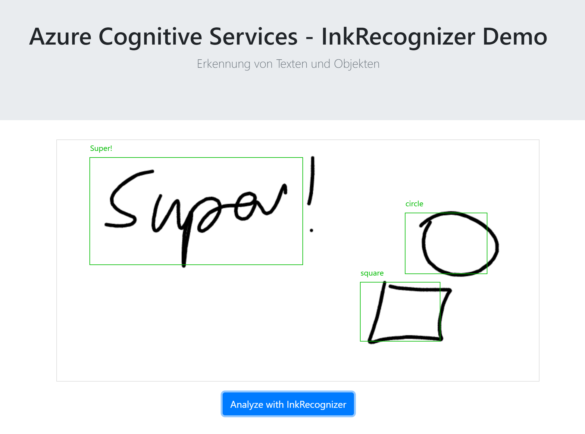

# Use Azure Ink Recognizer with Angular

Demo application to demonstrate the capabilities of the **Azure Ink Recognizer** in an Angular App.

> Important: For demo reasons I am calling the Cognitive Services API directly from the client side, which is maybe not the best idea in production scenarios. To hide your subscription key from the client it might be better to move this call to your API backend.

## Useful links
* [Ink Recognizer](https://azure.microsoft.com/en-us/services/cognitive-services/ink-recognizer/)
* [Ink Recognizer API](https://docs.microsoft.com/en-us/rest/api/cognitiveservices/inkrecognizer/inkrecognizer/recognize)
* [Signature Pad](https://github.com/szimek/signature_pad) on GitHub (@szimek)
* [Angular 2 component for Signature Pad](https://github.com/wulfsolter/angular2-signaturepad) on GitHub (@wulfsolter)